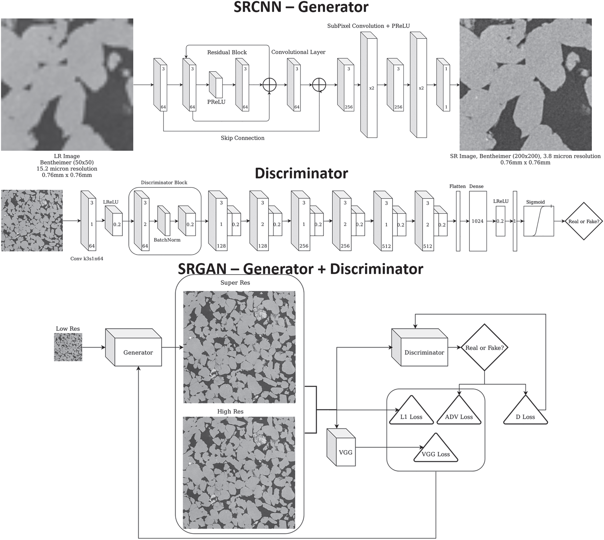
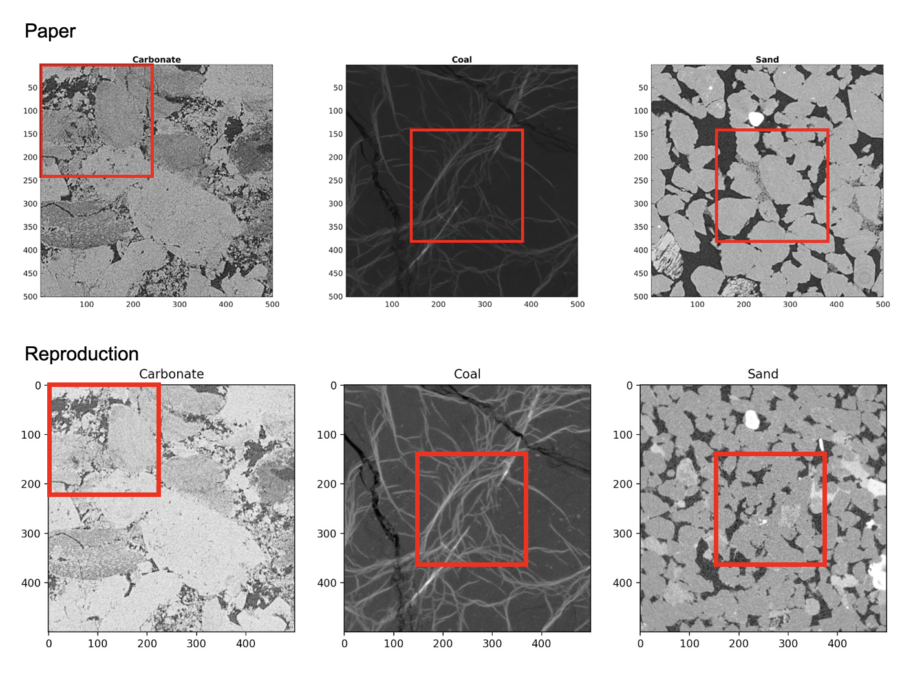
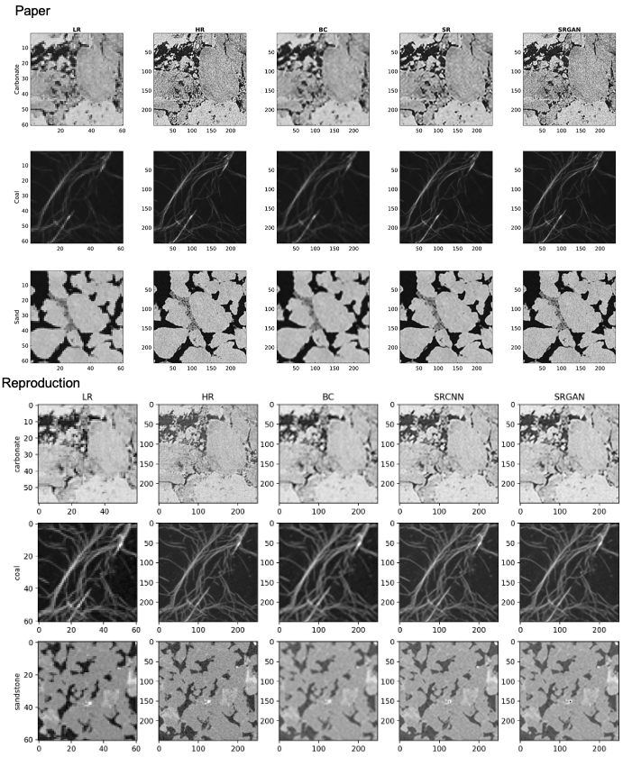
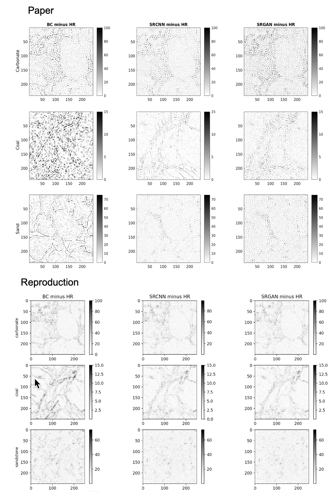
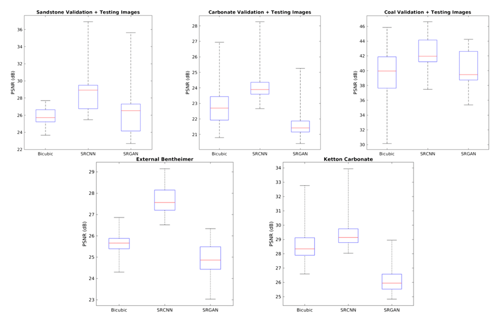
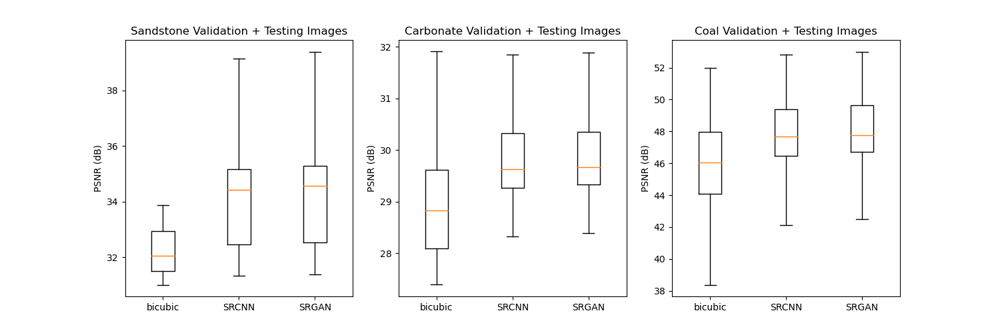

# Reproducing Boosting Resolution and Recovering Texture of 2D and 3D Micro-CT Images with Deep Learning

## Introduction 

In this blog we will describe our attempt and result in reproducing the paper Boosting Resolution and Recovering Texture of 2D and 3D Micro-CT Images with Deep Learning (Wang et al., 2019).  In this paper the authors explain and showcase the  Enhanced Deep SuperResolution Generative Adversarial Network (EDSRGAN) they designed. This model is designed to take low-resolution(LR) images and super resolve a high-resolution(HR) image from it. These images can then be used for image-based analysis techniques. The model the authors designed is able to handle 2D and 3D images, but for the scope of this project the choice was made to focus only on reproducing the 2D images.

As the code that was given with this paper uses a lot of old libraries and has a lot of old dependencies, running this model and training with it becomes quite hard. However the results in the paper are promising and we would like to see if these hold up. With this some of the paper's results seem questionable such as the lower PSNR values in figure 3. This is why we wanted to reproduce and train the model to compare these results to that of the paper.

The programming of the model was done in python, with the only notable difference to the paper being the use of Pytorch instead of Tensorflow. Not only was this part of the request given to us by our supervisor, but pytorch is also a widely used library with a lot of useful assets for programming large learning models in python. The model itself was directly taken as described and captioned within the paper. To get the most accurate results training and division of the data was done with the exact data and data set up as was used in the paper. 
The trained models were then used to recreate figure 2 and 3 from the original paper to see how these results compared.

There was also an attempt to recreate these same figures with the original code given by the authors of the papers. However getting this code to work turned out to be too time consuming of a task to do within the time span of this project. We later found an additionally forked repository that was easier to work with, but also this library had some issues. We decided that the best use of our time within this project was to reproduce and train the new model as this would give us the most control and confidence in the eventual results.


## Implementation

### Loading the data

In order to load the rock data samples efficiently (from [https://www.digitalrocksportal.org/projects/215](https://www.digitalrocksportal.org/projects/215)), there is a need for an efficient Data Loader that can transfer the samples to the GPU in batches and Dataset class that holds the location to the images.  The Dataset additionally can apply transformation on the samples if needed, in our case this is Random Cropping on both the low resolution and high resolution data samples to 64 x 64 (LR) and 192 x 192 (HR) and converting the samples to 1 colour channel, as all samples in the dataset are grey images represented by 3 identical colour channels. This was not mentioned in the paper but added by us.  An important note here is that the crops of the LR images and HR images are linked as the SRGAN should reproduce the HR images from LR images as best as possible using upscaling. The Torchvision transforms module has the `get_params` method that helps with that. 

```python
# Transform operations
t_random_crop = T.RandomCrop(48)

# Get random location parameters for Low Res image
params = t_random_crop.get_params(image_LR, (48, 48))

# Get same locations in the High res image
params_HR = list([i * 4 for i in params])

# Apply cropping
image_LR = T.functional.crop(image_LR, *params)
image_HR = T.functional.crop(image_HR, *params_HR)
```

Loading the corresponding LR and HR image can be done by removing "x4" from the LR filename, since the LR image and HR image have corresponding names.  A helpful resource in writing your own custom dataset and dataset loader can be found [here](https://pytorch.org/tutorials/beginner/data_loading_tutorial.html). 

### Architecture

The next step was to get the SRCNN - generator and Discriminator, represented by the Figure below, working in PyTorch.



This proved to be slightly more difficult than expected because it was unclear which exact module SubPixel Convolution represented in PyTorch, why an input size of 48 x 48 was used, which type of padding was used in the convolution layers, what the backward arrow from the first residual connection to the second convolution layers means, and how exactly we should read the diagram in general. A clearer representation of the Generator and Discriminator can be found below, printed using the torchsummary. We assume that the backward connection is actually a mistake as we couldn't find information on it or a similar use case where such an arrow is used. 

```
SRGAN - Generator
----------------------------------------------------------------
        Layer (type)               Output Shape         Param # 
================================================================
            Conv2d-1           [-1, 64, 48, 48]             640 
            Conv2d-2           [-1, 64, 48, 48]          36,928 
             PReLU-3           [-1, 64, 48, 48]               1 
            Conv2d-4           [-1, 64, 48, 48]          36,928 
     ResidualBlock-5           [-1, 64, 48, 48]               0 
            Conv2d-6           [-1, 64, 48, 48]          36,928 
            Conv2d-7          [-1, 256, 48, 48]         147,712 
      PixelShuffle-8           [-1, 64, 96, 96]               0
             PReLU-9           [-1, 64, 96, 96]               1
     UpscaleLayer-10           [-1, 64, 96, 96]               0
           Conv2d-11          [-1, 256, 96, 96]         147,712
     PixelShuffle-12         [-1, 64, 192, 192]               0
            PReLU-13         [-1, 64, 192, 192]               1
     UpscaleLayer-14         [-1, 64, 192, 192]               0
           Conv2d-15          [-1, 1, 192, 192]              65
================================================================
Total params: 406,916
Trainable params: 406,916
Non-trainable params: 0
----------------------------------------------------------------
Input size (MB): 0.01
Forward/backward pass size (MB): 97.03
Params size (MB): 1.55
Estimated Total Size (MB): 98.59
----------------------------------------------------------------
None

================================================================

Discriminator
----------------------------------------------------------------
        Layer (type)               Output Shape         Param #
================================================================
            Conv2d-1         [-1, 64, 190, 190]             640
         LeakyReLU-2         [-1, 64, 190, 190]               0
            Conv2d-3           [-1, 64, 94, 94]          36,928
       BatchNorm2d-4           [-1, 64, 94, 94]             128
         LeakyReLU-5           [-1, 64, 94, 94]               0
DiscriminatorBlock-6           [-1, 64, 94, 94]               0
            Conv2d-7          [-1, 128, 92, 92]          73,856
       BatchNorm2d-8          [-1, 128, 92, 92]             256
         LeakyReLU-9          [-1, 128, 92, 92]               0
DiscriminatorBlock-10          [-1, 128, 92, 92]               0
           Conv2d-11          [-1, 128, 45, 45]         147,584
      BatchNorm2d-12          [-1, 128, 45, 45]             256
        LeakyReLU-13          [-1, 128, 45, 45]               0
DiscriminatorBlock-14          [-1, 128, 45, 45]               0
           Conv2d-15          [-1, 256, 43, 43]         295,168
      BatchNorm2d-16          [-1, 256, 43, 43]             512
        LeakyReLU-17          [-1, 256, 43, 43]               0
DiscriminatorBlock-18          [-1, 256, 43, 43]               0
           Conv2d-19          [-1, 256, 21, 21]         590,080
      BatchNorm2d-20          [-1, 256, 21, 21]             512
        LeakyReLU-21          [-1, 256, 21, 21]               0
DiscriminatorBlock-22          [-1, 256, 21, 21]               0
           Conv2d-23          [-1, 512, 19, 19]       1,180,160
      BatchNorm2d-24          [-1, 512, 19, 19]           1,024
        LeakyReLU-25          [-1, 512, 19, 19]               0
DiscriminatorBlock-26          [-1, 512, 19, 19]               0
           Conv2d-27            [-1, 512, 9, 9]       2,359,808
      BatchNorm2d-28            [-1, 512, 9, 9]           1,024
        LeakyReLU-29            [-1, 512, 9, 9]               0
DiscriminatorBlock-30            [-1, 512, 9, 9]               0
          Flatten-31                [-1, 41472]               0
           Linear-32                 [-1, 1024]      42,468,352
        LeakyReLU-33                 [-1, 1024]               0
           Linear-34                    [-1, 1]           1,025
          Sigmoid-35                    [-1, 1]               0
================================================================
Total params: 47,157,313
Trainable params: 47,157,313
Non-trainable params: 0
----------------------------------------------------------------
Input size (MB): 0.14
Forward/backward pass size (MB): 118.61
Params size (MB): 179.89
Estimated Total Size (MB): 298.64
----
```

Some extra information on the summary:

- ResidualBlock is a nn.Module with a convolution layer followed by a PReLu activation function and another convolution layer. The output of the first convolution layer is then summed to the second convolution layer to get the residual connection. 
- UpscaleLayer, is a nn.Module consisting of a convolution layer followed by a PixelShuffle layer and PReLu activation. 
- DiscriminatorBlock, is a nn.Module consisting of a convolution layer followed by a BatchNorm2d layer and LeakyReLU activation. 

The VGG model mentioned in the paper uses the fully convolutional output from the sixteenth layer of the 19-layer VGG network, however the provided code does make use of this max-pooling layer. But since this is a reproducibility project and we are not sure whether their code actually works we assume that the paper is correct. The VGG model can be imported using:

```python
from torchvision.models import vgg19

vgg_original = vgg19(pretrained=True)  # Load the pretrained network
vgg_cut = vgg_original.features[:-1]  # Use all Layers before fully connected layer and before max pool layer
```

This results in an additional 20,024,384 parameters. Summing these parameters does not result in the same number of parameters described in the paper, but we could not figure out what the reason of this discrepancy was. 

### Training Procedure

Before jumping in the explanation of the training loop, we briefly give a short explanation on the loss functions used. All loss functions can be found in `Losses.Py`. 

- Discriminator Loss => `nn.BCELoss(weight=None, size_average=None, reduce=None, reduction='mean')`
- L1loss => `nn.L1Loss(size_average=None, reduce=None, reduction='mean')`
- L2loss => `nn.MSELoss(size_average=None, reduce=None, reduction='mean')`
- Adversarial loss (ADVloss) => takes as input probability of discriminator that input image is a Superresolution image so 1-ouput, and then again uses `nn.BCELoss(weight=None, size_average=None, reduce=None, reduction='mean')`
- VGG19_Loss => Still needs some pre-processing before it can be run through the VGG19 model but uses  `nn.MSELoss(size_average=None, reduce=None, reduction='mean')` in the end. 

The training procedure closely follows the paper representation as best as possible, but instead of running 1000 iterations per epoch the model is trained for 600 iterations per epoch and the number of epochs is increases to 166 epochs in phase 1 and 250 epochs in phase 2. This was done because 1000 iterations of training with a batch size of 16 equates to 16k samples, however the number of samples in the dataset is only 9.6k. By extending the number of epochs and reducing the number of iterations per epoch we loop through the entire dataset each epoch and the total number of samples stays the same. 

The training loop follows the following structure:

```python
# Training of SRCNN (Generator)
for phase, epochs in enumerate([epochs_gen, epoch_both]):
    # Each phase reinitialize optimizer
    optimizer_disc = torch.optim.Adam(disc.parameters(), lr_disc)
    optimizer_gen = torch.optim.Adam(gen.parameters(), lr_generator)

    # Skip phase 1 if the load_from_file flag is activated and weight path of generator is available
    if phase == 0 and load_from_file and weights_path_gen is not None:
        print("SKIP Phase 1")
        continue
    # Skip phase 2 if the load_from_file flag is activated and wieght path of discriminator is available
    if load_from_file and weights_path_disc is not None:
        print("SKIP Phase 2")
        continue

    # TQDM allows us to keep track of the training
    outer = tqdm(range(epochs), position=0, desc='Epoch', leave=True)
    for epoch in outer:

        # Initialize average loss values
        loss_gen_epoch = 0
        loss_disc_epoch = 0
        psnr_epoch = 0

        # Specify Inner progressbar which keeps track of training inside epoch
        inner = tqdm(total=600, desc='Batch', position=1, leave=False)

        # Loop through dataset with DataLoader
        for i_batch, sample_batch in enumerate(rd_loader_train):

            # Specify generator and discriminator mode (other mode would be eval())
            gen.train()
            disc.train()

            # Transfer image to GPU
            input_LR = sample_batch["LR"].to(device)
            target_HR = sample_batch["HR"].to(device)

            # Zero the parameter gradients
            optimizer_gen.zero_grad()
            optimizer_disc.zero_grad()

            # Generate Super Resolution Image
            SR_image = gen(input_LR)

            # Calculate loss
            g_loss = L1_loss(SR_image, target_HR)
            l2_Loss = L2loss(SR_image, target_HR)
            # Calculate Training PSNR
            psnr_single = PSNR(l2_Loss, 2)

            # If we are in the second training phase we also need to train discriminator
            if phase == 1:
                # Create classification Tensors
                label_real = torch.full((mini_batch_size, 1), real_label, 
						dtype=torch.float32, device=device)
                label_fake = torch.full((mini_batch_size, 1), fake_label, 
						dtype=torch.float32, device=device)

                # Training Super Resolution Images, training of SR and HR separate
                output_disc_SR = disc(SR_image.detach())  # Output discriminator (prob HR image)
                # Calculate loss Discriminator
                loss_disc_SR = criterion_disc(label_fake, output_disc_SR)

                # Only need the discriminator output of the SR images and p(sr) which is 1 - p(hr)
                p_sr_fake = torch.ones(mini_batch_size, device=device) - output_disc_SR.detach()

                # Calculate loss Generator
                adv_loss = ADVloss(p_sr_fake, device=device)
                vgg_loss = VGG19_Loss(SR_image, target_HR, vgg)

                # Backward and optimizer step
                loss_disc_SR.backward()
                optimizer_disc.step()

                # Training on High Resolution Images
                optimizer_disc.zero_grad()

                output_disc_HR = disc(target_HR.detach())
                loss_disc_HR = criterion_disc(label_real, output_disc_HR)

                # Backward and optimizer step
                loss_disc_HR.backward()
                optimizer_disc.step()

                loss_disc = (loss_disc_HR + loss_disc_SR)
                # Keep track of the loss value
                loss_disc_epoch += loss_disc

                # Update loss calculation
                g_loss += alpha * vgg_loss + beta * adv_loss

            # Backward step generator
            g_loss.backward()
            optimizer_gen.step()
            # Keep track of average Loss
            loss_gen_epoch += g_loss

            # keep track of average psnr
            psnr_epoch += psnr_single

            # Update progressbar and iteration var
            inner.update(1)
            if phase == 0:
                inner.set_postfix(loss=g_loss.item(), loss_l2=l2_Loss.item())
            else:
                inner.set_postfix(loss=g_loss.item(), loss_l2=l2_Loss.item(), adv_loss=adv_loss.item(),
                                  vgg_loss=vgg_loss.item(), dloss=loss_disc.item())

        # Keep track of generator loss and update progressbar
        loss_avg_gen = loss_gen_epoch.item() / len(rd_loader_train)
        loss_generator_train.append(loss_avg_gen)

        # append average psnr loss
        psnr_avg = psnr_epoch / len(rd_loader_train)
        psnr_values.append(psnr_avg)

        if phase == 0:
            outer.set_postfix(loss=loss_avg_gen, psnr=psnr_avg)
        else:
            loss_disc_avg = loss_disc_epoch.item() / len(rd_loader_train)
            loss_discriminator_train.append(loss_disc_avg)
            outer.set_postfix(loss_gen=loss_avg_gen, loss_disc=loss_disc_avg, psnr=psnr_avg)
    # Save generator model weights (for both phases)
    torch.save(gen.state_dict(), 'weights/model_weights_gen_{}_{}.pth'.format(phase + 1, time.time()))
    # Save Discriminator (only for phase 2)
    if phase == 1:  
        torch.save(disc.state_dict(), 'weights/model_weights_disc_{}_{}.pth'.format(phase + 1, time.time()))
		
        # Function to calculate the PSNR values
        calculate_psnr(gen, rd_loader_valid_carbo, rd_loader_valid_coal, rd_loader_valid_sand,
	rd_loader_test_carbo, rd_loader_test_coal, rd_loader_test_sand, phase)  
```

We chose to use `tqdm` to have more insight in the training procedure by giving an estimated time but also showing the current loss values for that batch or epoch. 

It is important during phase 2 to detach the generated Super Resolution image otherwise it will be added to the computational graph of the Discriminator and be cleared when the backward pass is performed! The same holds for calculating p(SR) = 1 - p(HR) as p(SR) is used for the adversarial loss. 

The PSNR values are calculated by looping through all separate data loader (6 in total) and adding their respective PSNR value to a dictionary (carbonate, coal, sandstone). The results are then saved in a JSON file. 

### Recreating Figure 2 and 3
The models were used to reproduce Figure 2 and 3 from the paper. The figures were mainly reproduced through attentively looking at how they were composed and recreating this. It was additionally necessary to perform bicubic interpolation on images from the validation and test set. For this we employed the Upscale function from Torch: 
```python
def bicubic_interpolation(image_LR, scale_factor):
   """
   Creates a bicupic interpolated image
  
   Output image depends on scale factor (2x or 4x)
   """
   up = nn.Upsample(scale_factor=scale_factor, mode='bicubic')
   upscale_image_LR = up(image_LR).view(1, image_LR.shape[2]*4, image_LR.shape[3]*4)
  
   return upscale_image_LR
```


## Results
For the scope of this project we focused on reproducing Figure 2 and 3 of the paper. Figure 2 is composed of three elements, which are shown separately. In figures below we first show the result from the paper and then the reproduced result. 

Here we see the images plotted in full resolution. We tried to use the same example images as used in the paper, we did not succeed for sandstone, where we used a similar looking image. The red square indicates the cropping for the following parts of this figure. 



In this part of the figure we see the effect of the different techniques which were implemented. At first the low resolution input image is shown, secondly the high resolution input (the “ground truth”), the bicubic interpolation image, the image generated by the SRCNN model and lastly the image generated by the SRGAN model. The difference between the SRCNN and SRGAN model is more profound in the paper compared to our result. The results from the paper show a more grainy aspect to the SRGAN produced image compared to the SRCNN produced image. 



In the final part of the figure, the high resolution image is subtracted from the implemented technique. The absolute difference of pixel values is plotted. We choose a similar clipping approach as used in the paper, so the pixel values for carbonate run from 0 to 100, and for coal from 0 to 15, etc. This strategy highlights the differences. Here we can again see that there are differences between SRCNN and SRGAN, where our results do not differ as much. 



FIGURE 3 

In Figure 3 of the paper the Pixel-to-Noise Ratio (PSNR) values are depicted for each technique. Here we show the original picture. The ratio is aimed to be as high as possible. Below the results are shown produced with our models. We did not incorporate the results from the external datasets (Bentheimer and Ketton Carbonate) because we were at last not able to. 

The PSNR ratio decreases in the paper for SRGAN compared to SRCNN. It is expected to increase, because a higher resolution image is supposed to show more signal opposed to noise. In the paper the PSNR value is thus argued because the value will become lower when there is not a pixel wise match (between the produced image and the ground truth image), but visually the output may have improved. 

Figure 3 from paper: 


In the reproduction of this figure we can see that the PSNR values for SRCNN and SRGAN are similar, which is expected from the result in Figure 2. Also, all the PSNR values are higher compared to the values in the paper. 



## Discussion
At the github([https://github.com/yingDaWang-UNSW/EDSRGAN-3D](https://github.com/yingDaWang-UNSW/EDSRGAN-3D)) page of the paper the authors provide the code for the EDSRGAN model as well as a manual for the installation and training of it. The manual was followed, but the model was not able to run. This could be caused by backward compatibility issues of the libraries used in the model. Due to the cluttered code and the limited time available it was decided that running the model of the authors would not be pursued.

While implementing the EDSRGAN model in pytorch there were a few details unclear from the paper. These details consist of how the model was padded and how the binary cross entropy(BXE) was calculated in equation 4. The padding problem was solved by looking into the code of the authors and finding that the padded values were equal to 0. The BXE problem was solved by assuming that the parameter N in the sum, represented the nth picture in the batch. It was also assumed that the label ySR = 1–yHR, this was necessary since ySR was defined as 0 meaning that the BXE of the SR image would always be 0. This also corresponds with the code of the authors, meaning that it should not lead to different results for the reproduced model. 

In figure 2 of the paper there is a clear difference in sharpness, especially for the Carbonate, between the SR and the SRGAN generated images. In the same figure created from the reproduced model this difference is not as significant. 

This difference in results could be attributed to a discrepancy between the architecture as stated in the paper and the implementation in the code of the authors. In the paper it is stated that the fourth convolutional output prior to the fifth max-pooling layer in the VGG-19 network would be used, however in the code the output of the fifth max pooling layer is used. For the reimplementation of the model the output prior to the fifth max-pooling layer of the VGG-19 network was used. This creates a difference between the two models, but it is not believed to have a big impact on the models performance, since the maxpool layer of the VGG-19 network only discarts information and does not modify information. This is important because the output is only used in the VGG-19loss function where they are subtracted and then squared. Due to the square the bigger values in the VGG-19 network output have more influence, which would also be the values selected by the maxpool layer. Therefore the change in the loss function is expected to be minimal. 

Another possible explanation for the insignificant difference in sharpness of the reimplemented model could be the discriminator loss Dloss approaching 0, which is known as a mode collapse. When this happens it means that the discriminator can perfectly classify the images as real or fake. This is undesirable because it also means that the generator does not produce images of a good enough quality for the discriminator to be fooled. Which defeats the whole point of the SRGAN network, the two networks do not train together anymore. This mode collapse is not mentioned by the authors of the paper and is believed to be the primary cause of the difference in sharpness between the reimplemented results and the papers results. Possible ways to improve the training of GANS are highlighted in [https://proceedings.neurips.cc/paper/2016/file/8a3363abe792db2d8761d6403605aeb7-Paper.pdf](https://proceedings.neurips.cc/paper/2016/file/8a3363abe792db2d8761d6403605aeb7-Paper.pdf), which mentions techniques like, feature matching, minibatch discrimination, historical averaging, one-sided label smoothing and virtual batch normalization. Another possible remedy for mode collapse is to lower the learning rate of the discriminator but finding a suitable learning rate is fairly difficult. We implemented label smoothing by setting the target of the real images to a value between 0.9 and 1. But this led to no further improvement of the results. 

In figure 3 of the reimplemented model the PSNR value for the SRCNN and the SRGAN are about equal. While in figure 3 of the paper the PSNR of the SRCNN is higher than that of the SRGAN. This discrepancy is also thought to be caused by the mode collapse of the discriminator. Due to the mode collapse the generator is not trained well anymore and thus does not change its behavior, which explains the PSNR of the SRCNN and the SRGAN being equal. 

